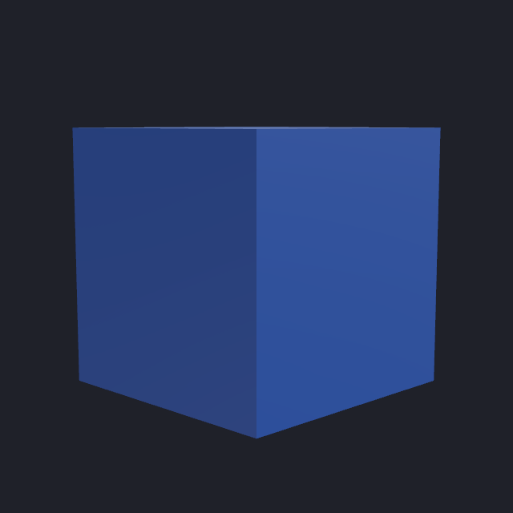
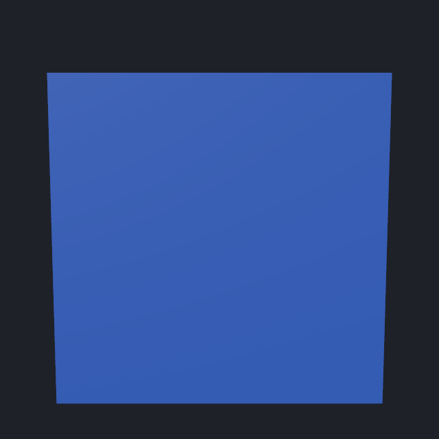

# Processed preview validation

Validated September 7, 2026 (America/Toronto). The implemented preview composes isolated copies of the pinned avatar and processes them through NDMF. The evidence below establishes the capture, processing, rendering, and lifecycle contracts using owned synthetic fixtures. It does **not** establish fit, expression fidelity, upload success, or performance on the real Shinano avatar.

## Tested dependencies and scope

| Dependency | Tested version | What the validation covers |
| --- | --- | --- |
| Unity Editor | 2022.3.22f1 | EditMode tests and a persistent, graphics-enabled macOS worker; a separate project and Library directory |
| Modular Avatar | 1.18.7 | Prepared MA candidates, existing generated wardrobe defaults, and NDMF composition |
| NDMF | 1.14.8 | Public avatar processing API with temporary output; processing failures prevent a successful snapshot |
| VRChat SDK Avatars/Base | 3.10.5 | Descriptor, menu, parameter, PhysBone, and contact contracts; SDK upload callbacks are outside the snapshot |
| Avatar Optimizer | 1.9.18 | Separate appearance tests apply the public default `TraceAndOptimize` component to an isolated copy and review its application; internal optimizer fields are not configured |
| Gesture Manager | 3.9.9 | Separate appearance tests cover its public favourite-avatar setting and Undo; emulator motion is not evaluated in photographs |

The three-view worker smoke below used the core Unity/MA/NDMF/SDK fixture. Optional AAO and Gesture Manager tests ran separately after those tools were copied into the disposable fixture. Their successful adapter tests do not establish every combination of creator plugins.

Supported inputs are an existing scene avatar and a static or creator-prepared MA wardrobe candidate, or the current avatar alone. The before and after copies retain the source body and existing clothes. A replacement addresses the exact worn instance by sibling indices, including duplicate names, and preserves its placement and active state. Adding a candidate makes it visible in the resolved scope. Existing preset/common scope rules and recognized wardrobe default controls are resolved into a shared recipe before processing.

The current recipe rejects newly generated part controls and a new Menu Group assignment. An absent or ambiguous preset holder, conflicting generated defaults, or a default target removed during processing also prevents a successful preview. These cases must not authorize Wear from an inaccurate photograph.

Known unsupported inputs include VRCFury (`VF.*`/`VRCFury*`), lilycalInventory, missing scripts, another avatar used as the candidate, and a skinned candidate lacking supported MA outfit setup. The shadow capture additionally rejects project-local creator scripts or NDMF plugins, scene-external references it cannot preserve, unsupported nonpersistent resources, and dirty imported resources. Imported shaders must be available and usable. Failure messages identify the relevant component or resource instead of returning a successful partial preview.

Snapshots use the copied source pose and processed static visibility. They do not evaluate generated animator states, gesture animations, expression-control interaction, PhysBone motion, or VRChat runtime behavior. NDMF passes are included; separate creator build pipelines and SDK upload callbacks are not. Additional packaged components are reported in the preview limitations. Copied packages remain trusted Unity code; the worker project is an isolation boundary for files and scene state, not a sandbox for arbitrary plugin code.

## Capture, revisions, and apply safety

Capture runs on the source Editor's main thread. It serializes the complete current clone, including supported unsaved hierarchy, material, and controller overrides, into an isolated prefab and a resource container. The prefab is a serialization format for the captured instance; loading the original prefab asset is not a substitute for capturing the scene state. Animator graph resources share a container so state and transition references survive import.

The capture manifest and checksummed inputs live under `Library/AvatarWardrobe/captures/<capture-id>/`. Temporary assets use a unique `Assets/__WardrobeCapture_<capture-id>` folder and an ownership journal. Normal completion, failure cleanup, and reload recovery remove only recorded staging paths. Capture tests assert source hierarchy/material state, selection, and settings preservation. Capture does temporarily import its own staging assets; it is not a filesystem-read-only operation.

The desktop stages asset, metadata, settings, and package **copies** into an owned worker project with its own Library. It does not symlink mutable source inputs. The manifest declares the Unity version, build target, color space, quality level, package versions, file checksums, and recipe. The worker validates these inputs and requires a graphics device; it is not launched with `-nographics`. Changing captures is handled by stopping and restaging the worker after the active request finishes.

Every result carries capture, source, recipe, and environment revisions plus its view specification. The operation receipt retains the exact project/avatar identity and full confirmed revision used for Wear. Photographs have a separate visual revision: supported logical menu label-only edits may reuse a photograph, while the full operation revision still changes. Unknown or older results fall back to conservative source-revision invalidation. Cached photographs preserve their original image provenance; cache reuse does not bypass the apply guard.

## Measured synthetic rendering evidence

One persistent graphics-enabled Unity process imported an immutable synthetic capture and returned all three requested views. It used a blue cube with a VRChat descriptor: 1 renderer, 1 material, 12 triangles, and no textures or dynamic components. Source, recipe, environment, view, and PNG checksums matched the requests. The process stopped through the worker's typed stop command.

| Front, before | Three-quarter, after | Back, after |
| --- | --- | --- |
|  |  |  |
| 16,217 bytes | 21,999 bytes | 24,004 bytes |

The images are 640 × 640, with neutral lighting, yaw angles 180°/135°/0°, and zoom 1. Before and after share bounds-based framing. This smoke used no candidate; separate Unity tests cover composed candidate rendering and exact replacement.

| Measurement | Observed value and limit of inference |
| --- | --- |
| Cold private-project import to ready | Approximately 80 seconds, observed with 10-second status polling; not a precise startup benchmark |
| Preparing both processed copies | 473 ms reported by the worker; excludes project staging/import and individual image rendering |
| Desktop facade smoke | Queued → waiting for worker → rendering → succeeded; about 17 seconds from receipt creation to success using an already imported worker project; its preparation reported 847 ms |
| Repeated facade request | Reused the completed cached photograph; pinning and orderly service shutdown also succeeded |
| Initial captured package inputs | 938,880,482 bytes (895.39 MiB), across 18 nonbuilt-in packages in that fixture |

PNG SHA-256 values, preserved by the committed evidence files:

```text
front          235df282f6e1db32be8a86f86155a7e333eda7b8ab135977a331ee511e91dcb7
three-quarter  f3a7ae9cc2c4343adfbded930bec9abf7d37b23c57f691d77c803cb79f782aa1
back           9ad4fcb3d7b625d3b8e66def569bd8876abc9261ed5ea5cbdbd36749a4efccc7
```

The 11 `TryOnTests` passed in the isolated Unity fixture. They cover actual NDMF processing and PNG output, exact duplicate-name replacement, source preservation and invalidation, unsupported inputs, scoped/default visibility, material/controller capture import, repeated package snapshot reuse, interrupted capture cleanup, and visual revision behavior. Python shadow and retention tests cover input checksums and ownership, automatic worker lifecycle, cache reuse, result mismatch rejection, HTTP boundaries, and active/pinned retention. The actual graphics smoke predates the retention extension; the later Unity and Python tests validate that extension separately.

## Cache and performance bounds

Package snapshots are content-addressed by package name, version, and ordered file checksums under `Library/AvatarWardrobe/package-snapshots/`. Unchanged package contents are copied once and reused by later capture manifests. Each worker project still receives its own copies. This avoids storing another 895 MiB of unchanged fixture packages for each capture, but hashing package inputs still takes source-Editor time. No heavy-avatar capture latency target has been established.

| Resource | Default behavior |
| --- | --- |
| Captures | Prune oldest eligible captures when exceeding 20 captures or 2 GiB; preserve the newest, captures younger than 24 hours, active leases, and pinned captures |
| Package snapshots | 4 GiB soft limit; remove only old, owned snapshots unreferenced by retained manifests, with a 24-hour grace period |
| Desktop PNG history | 256 MiB soft limit; preserve pinned photographs, the current result, and the latest photograph for each avatar/view/before combination |
| In-flight capture protection | A lease lasts at least 1 hour, or three times the configured worker timeout; normal completion/cancellation releases it |
| Worker requests | One executor and one persistent worker per service; default readiness and render waits are 180 seconds each, not an end-to-end deadline |
| In-memory previews | At most two prepared sessions; expire after five idle minutes and clear on reload, play-mode transition, or shutdown |
| Image input | Fixed views, finite zoom bounded to 0.5–2.5, 640-pixel output |

These are soft storage limits. Pinned, active, recent, and newest retained inputs can exceed them. Retention does not delete unknown folders or malformed ownership records. Temporary copy paths are cleaned on normal failures; no hard upper bound is promised for arbitrary crash debris or private Unity Library size.

Source capture and NDMF preparation are synchronous main-thread work. The active-project fallback processes two whole copies and can pause that Editor. Cancellation takes effect at the next supported boundary; it cannot interrupt an NDMF pass already running. The shadow path moves build/render work into the private Editor but still requires source capture. None of the small synthetic timings predicts a large creator avatar's latency or memory usage.

Metrics include renderer, material, texture, triangle, PhysBone, contact, expression parameter, and menu-control counts. Texture bytes and the largest contributors use Unity runtime allocation estimates for distinct referenced textures. They include Editor allocations and are not exact platform VRAM. Static count changes are not evidence of FPS, upload rank, or visual improvement.

## Real-project audit and remaining validation

A read-only audit inspected saved YAML and package metadata in the real Shinano project. It did not connect to the live Editor, inspect unsaved scene state, save a scene, change selection, or modify source files. `Library/LastSceneManagerSetup.txt` listed `shinano-smol-2026.unity` and an active generated `Upload.unity` staging scene.

The saved staging scene `Assets/Generated/WardrobeUploads/ShinanoS6_Main_2_50c4e0/Upload.unity` contains the root `ShinanoS6_Main_2_Wardrobe_50c4e0` and three enabled `VF.Model.VRCFury` components: one on the root and two under `Dynamic VRC Floor/Toggle [Delete me if not using]`. Its SHA-256 was `f8515e2285bcc065db7027fb6358a340601497cff8258e200761d371230a1168`. These components fall directly within the worker's explicit rejection rule. This is source-file support evidence, not an executed real-avatar capture or PNG.

The other loaded saved scene's serialized prefab closure also references VRCFury and project-local marshmallow/Tabako creator scripts. The audited source environment had Unity 2022.3.22f1, MA 1.18.7, NDMF 1.14.8, SDK 3.10.5, VRCFury 1.1426.0, AAO 1.9.18, d4rkAvatarOptimizer 4.5.4, FaceEmo 1.7.0, and KawaiiPosing 3.0.10. These observations are not a tested compatibility matrix for those additional tools.

A safe next validation for supported saved content is to copy its complete scene/dependency closure and exact packages/settings into a distinct owned project, then invoke capture and rendering there. That can validate saved overrides without touching the live staging scene. It cannot establish the current unsaved state. Removing unsupported creator components to obtain an image would change the avatar being validated and must not be presented as faithful Try On.

UI follow-up proposal: before queuing capture, run one bounded support preflight for the pinned avatar and selected candidate, returning the first unsupported component path or missing environment requirement. Display that specific reason beside the Try On action and disable submission for that revision. Refresh the preflight only when the target, source revision, or candidate changes. Existing capture failures remain authoritative if the source changes after preflight. This proposal does not add automatic component removal or claim broader engine support.


## Kept-photo history

The desktop dressing room loads kept photographs from local metadata after a page or host restart. Each entry identifies its saved project, scene avatar, preset, source revision and view. Opening a photograph is read-only and does not restore a Wear token or modify scene objects. Current-avatar reload recovery uses separately verified source metadata; older captures without classified input remain history-only.

Kept photographs can be opened, exported as their exact verified PNG bytes, or unkept. Up to 100 photos may be kept; existing pins are never silently evicted. Unkept recent images are subject to a 1,000-entry and soft 256 MiB cache policy. History pages contain at most 100 entries (the UI requests 12), omit heavy preview payloads, and expose no internal manifest/image filesystem path. Open and export verify the cached checksum and selected project, and reject linked or foreign files. Kept source-capture markers are released on unkeep. These controls are desktop-only; active Unity fallback photographs do not have durable desktop history.

The local routes are GET `/api/shadow/history` (optional `pinned`, `limit`, `offset`, `avatarId`, `sceneGuid`, `scopeId`), GET `/api/shadow/photo?key=...`, GET `/api/shadow/export?key=...`, and the existing POST `/api/shadow/pin` with `{key,pinned}`. PNG export contains image bytes only.
